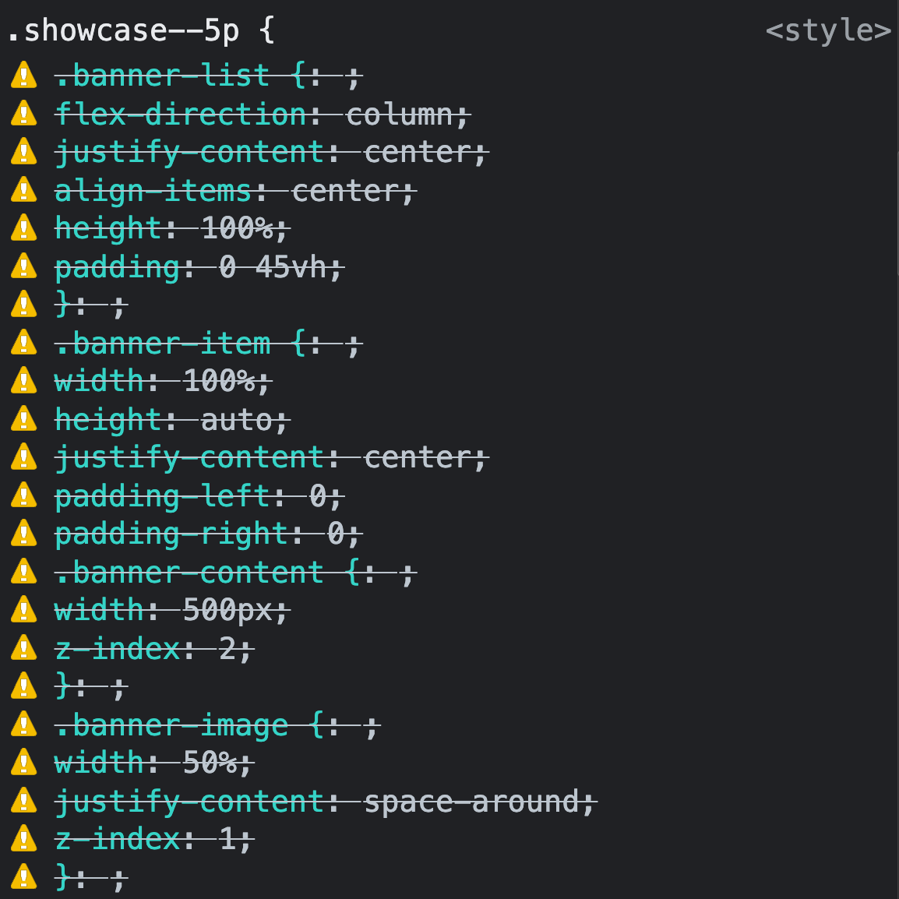

> 회사에서 프로젝트를 진행하다가 알게 된 내용을 정리해보았다.

프로젝트를 시작할 때마다 느끼는 것이지만, 개발 환경 설정은 쉽지 않은 것 같다. 그 중에서도 프로젝트 폴더를 구조화하는 것은 너무나도 어려운 일이다.

혼자 프론트엔드 개발 업무를 하고 있는 입장에서 함께 고민할 팀원이 없기 때문에 오롯이 혼자 결정해야 할 몫이다.

이번 글에서는 이 중에서 공통 스타일링 파일, 특히 `Sass(SCSS)`(`CSS`의 전처리기)를 사용하는 프로젝트에서 **파일을 _import_ 할 때** 주의해야 하는 내용을 다뤄본다.

<!--truncate-->

## Vue에서 Sass(SCSS) 사용

진행 중인 프로젝트는 `Vue CLI` 4 버전대를 사용하여 생성했다. `SCSS`를 추가하고, 컴포넌트마다 아래의 코드처럼 스타일링을 추가하고 있다.

```html
<style lang="scss" scoped>
  ...
</style>
```

개인적으로 `Sass`와 같은 전처리기를 사용하는 이유는 여러 가지가 있지만, 핵심은 바로 nesting이다. HTML 태그와 비슷하게 selector의 _parent_ 와 _children_ 관계를 작성할 목적이다.

개발을 하다보면 공통적인 요소들이 늘어나기 시작한다. 그에 따라 단일 페이지 컴포넌트를 **컨테이너 컴포넌트**와 **프레젠테이셔널 컴포넌트**로 나누기도 한다.

점점 반복적인 패턴의 마크업과 스타일링 코드들의 **중복을 제거**하는 방법에 대한 고민이 깊어집니다. Vue에도 너무나 다양한 디자인 패턴 예시가 존재하기 때문에 `slot`을 사용할지 등 여러 방법을 두고 고민을 거듭하게 된다.

> 본 포스팅의 주제는 특정 페이지에서만 `SCSS` 파일을 따로 작성하는 것이다.

### .scss 파일을 .css 파일처럼 import하면... 응?

컴포넌트의 스타일링 코드를 가져와서 새로운 `SCSS` 파일을 만든 후(`~@/assets/scss/pages/detail.scss`), 해당 파일을 원래 자리에 import 하기 위해 아래와 같이 작성했다.

```html
<style lang="scss" scoped">
@import url('~@/assets/scss/pages/detail.scss');
</style>
```

그리고 해당 페이지에서 아래의 코드가 반영되었는지 개발자 도구로 요소 검사를 해봤다.

```scss
.showcase--5p {
  .banner-list {
    flex-direction: column;
    justify-content: center;
    align-items: center;
    height: 100%;
    padding: 0 45vh;
  }
  .banner-item {
    width: 100%;
    height: auto;
    justify-content: center;
    padding-left: 0;
    padding-right: 0;

    .banner-content {
      width: 500px;
      z-index: 2;
    }
    .banner-image {
      width: 50%;
      justify-content: space-around;
      z-index: 1;
    }
    ...;
  }
  ...;
}
```

개발자 도구가 알려준 내용은 놀랍게도 충격적(?)이었다.



`Sass`의 nesting이 반영되지 않은 채 오류를 일으키고 있었다.

### 원인은 Webpack...?

파일을 불러오는 코드를 다시 살펴보자.

```html
<style lang="scss" scoped">
@import url('~@/assets/scss/pages/detail.scss');
</style>
```

여기서 문제를 일으킨 것은 바로, **`url()`** 형태로 작성된 코드였다.

아래와 같이 url()을 쓰지 않고 `string` 값만 입력하는 형태로 수정했다.

```html
<style lang="scss" scoped">
@import '~@/assets/scss/pages/detail.scss';
</style>
```

이상한 에러 메세지는 사라지고 제대로 반영된 것을 확인할 수 있었다.

---

해당 문제는 Webpack의 **sass-loader** 문서([Problems with url(...)](https://webpack.js.org/loaders/sass-loader/#problems-with-url))에서 단서를 찾았다.

하지만, [css-loader](https://webpack.js.org/loaders/css-loader/#import)를 읽어봐도 **`@import url();`와 `@import '';`의 차이**를 이해할 수는 없었다. 기본적으로 모두 같은 형태로 변환된다고 설명하고 있기 때문이다.

_sass-loader_ 에서도 내부적으로는 _css-loader_([Dev Dependencies](https://www.npmjs.com/package/sass-loader?activeTab=dependencies))를 사용하고 있는 것을 확인할 수 있다.

### CSS에도 데이터 타입이 존재하더라

원인을 정확히 이해하기 위해서 끈질기게 구글링을 하다가 MDN에서 또 다른 단서를 찾았다.

**[CSS data types](https://developer.mozilla.org/en-US/docs/Web/CSS/CSS_Types)**를 읽어보며, CSS에도 데이터 타입이란 게 있구나... 하고 머리가 지끈해졌다. ~~험난한 프론트엔드 개발자의 길~~

CSS에도 다양한 데이터 타입이 존재하는데, 그 중 이번 포스팅 내용에 해당하는 [`<string>` 타입](https://developer.mozilla.org/en-US/docs/Web/CSS/string)과 [`<url>` 타입](<https://developer.mozilla.org/en-US/docs/Web/CSS/url()>)을 이해하면 좋을 것 같다.

### 마무리

정확한 _동작 원리_ 를 이해하지 못하는 개발은 굉장히 힘들 수 있다는 사실을 또 한번 깨닫게 된 계기가 되었다.

앞으로도 공식 문서를 위주로 꾸준히 읽으며 개발 실력을 키워나가야 할 것 같다.

🧘🏻
