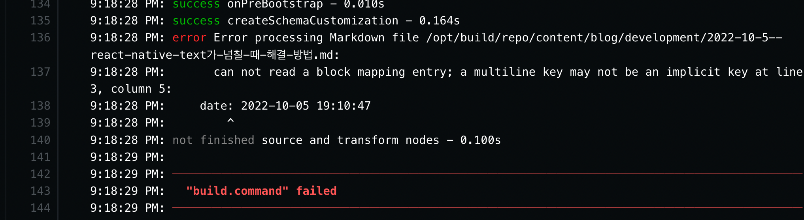

## 문제

Gatsby로 블로그를 만들고 포스팅하고 있다.

앞서 작성한 포스팅을 commit 후 push하고 한참을 기다려도 브라우저에 나타나지 않았다.

<!--truncate-->

Netlify에 가서 error log를 확인해보니 예상대로 어떤 문제 때문에 빌드가 진행되지 않고 있었다.



> ...???

## 원인

title에 쓴 _대괄호([ ], Square brackets)_ 가 문제를 일으키고 있었다!

```md
---
title: [React Native] Text가 넘칠 때 해결 방법
date: 2022-10-05 19:10:47
category: development
draft: false
---
```

## 해결 방법

간단하다. _quote_ 로 묶어주면 된다.
single이든 double이든 상관없다.

_backtick_ 을 써도 된다.

```md
---
title: '[React Native] Text가 넘칠 때 해결 방법'
date: 2022-10-05 19:10:47
category: development
draft: false
---
```

해결 완료!
