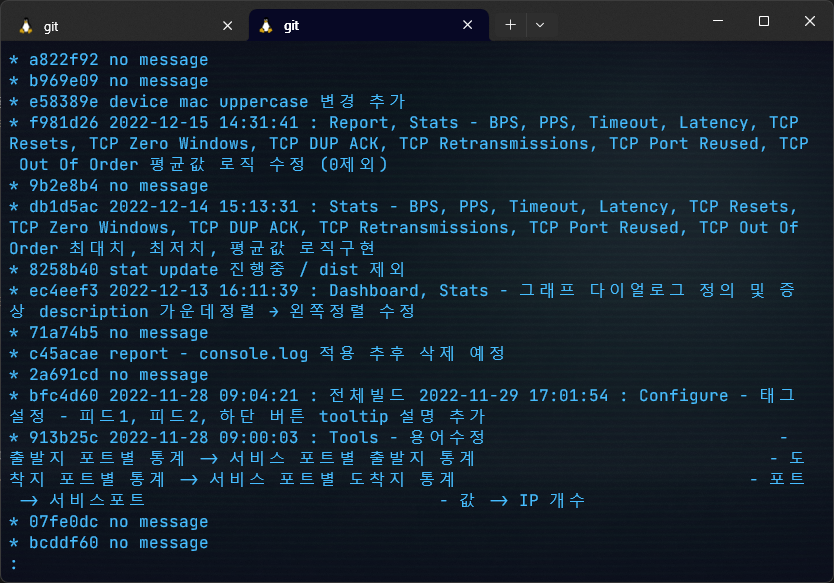
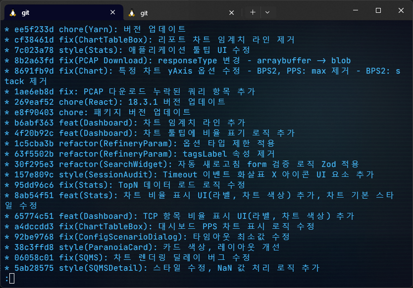
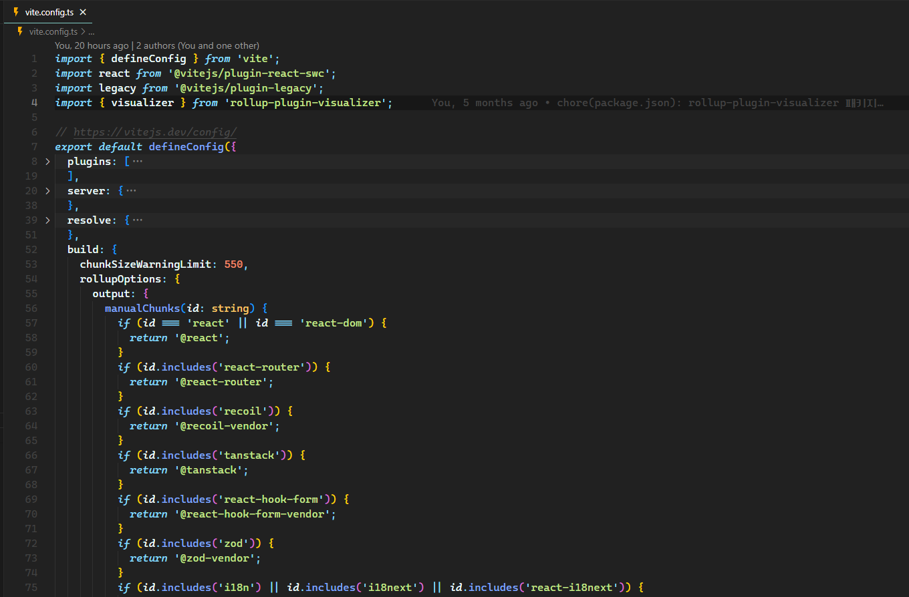
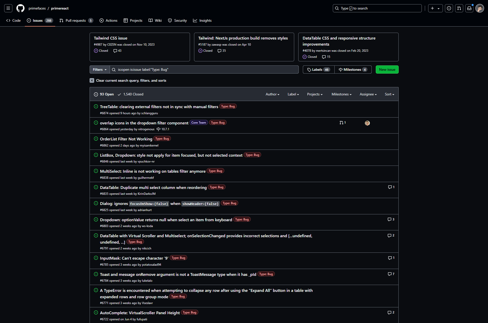
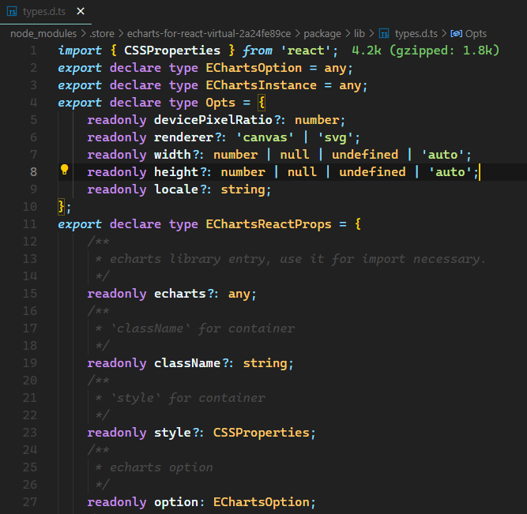

입사하고 6개월 즈음, Vue 2(Quasar Framework) 기반의 제품을 외주 개발자가 React로 마이그레이션 하던 중에 계약이 종료되어 인계를 받게 되었다. 미완성된 React 버전 제품의 기능을 원래의 수준 또는 그 이상으로 만들기 위해 열심히 뜯어 고침과 동시에 개발 환경을 개선하기 위해 많은 시도를 했다. (현재진행형)

<!--truncate-->

Vue.js 2 버전과 Quasar 1 버전 기반의 기존 제품 코드를 참고하며 React 마이그레이션을 해야 했다. Node.js LTS 버전이 18이던 그때 당시의 제품 스펙은 Node.js v14와 Vue.js v2 + Quasar Framework v1으로 상당히 오랜 기간 라이브러리/패키지 버전을 신경쓰지 않은 상태였고, Node.js 버전에 호환되지 않던 기존 제품 덕분에 한동안은 `nvm`으로 버전을 변경해가며 작업하느라 상당히 번거로운 기간이 있었다.

작업하며 이따금 살펴봤던 [Quasar v1](https://v1.quasar.dev)도 상당히 좋은 프레임워크인 것 같은데, TypeScript를 잘 지원한다는 Vue 3 버전과 [Quasar v2](https://quasar.dev)으로 업그레이드하고 리팩토링을 잘 해주었다면 굳이 큰 비용을 들여가며 React로의 마이그레이션이 필요했을까? 라는 생각도 했었다. ~~덕분에 React에 익숙해졌어요~~

## 개선 내용

- 포맷팅이 적용되지 않은 코드
  - Prettier 적용
- 가독성이 중요한 제품에 적절치 못했던 웹 폰트 (ELAND_Choice_M.ttf)
  - Pretendard Variable 👍
- 타입스크립트로 작성했으나 타입스크립트의 장점을 살리지 않은 코드
  - `types` 디렉토리 추가해서 페이지/기능 단위로 타입 작성하고 네이밍 수정
- 천 줄에 육박하거나 넘어가는 코드들
  - 적절한 단위나 기능으로 컴포넌트화
- 엄청나게 많았던 중복 코드 제거
  - 다른 라이브러리에서 동일한 기능을 제공하면 제거 (useInterval hook, classnames 등)
- 네이밍 수정이나 코드 축소 등으로 가독성 개선
  - onHide, handleHide → handle로 통일
  - `handleClickDownload`, `onDownloadClick` 등의 이벤트 핸들러의 네이밍 규칙 → `handleClickDownload`
  - `open` (뭘 오픈하고 싶은게냐) → `visibleDialog`
- inline 스타일을 최대한 제거
  - Tailwind CSS & SCSS로 많이 변경
- create-react-app & Webpack
  - Vite ⭐
- 혼용되던 패키지 매니저 (코드에 npm, yarn 둘 다 있었음…)

  - npm 걷어내고 yarn berry(v4) 도입
  - pnpm 방식의 nodeLinker 설정

    - `package.json`
      ```json
      {
      	...
        "packageManager": "yarn@4.3.1"
      }
      ```
    - `.yarnrc.yml`

      ```yaml
      compressionLevel: mixed

      enableGlobalCache: false

      nodeLinker: pnpm

      packageExtensions:
        '@semantic-release/changelog@*':
          dependencies:
            semantic-release: ^23.0.0
        '@semantic-release/commit-analyzer@*':
          dependencies:
            semantic-release: ^23.0.0
        '@semantic-release/git@*':
          dependencies:
            semantic-release: ^23.0.0
        '@semantic-release/npm@*':
          dependencies:
            semantic-release: ^23.0.0
        '@semantic-release/release-notes-generator@*':
          dependencies:
            semantic-release: ^23.0.0
        '@testing-library/user-event@*':
          dependencies:
            '@testing-library/dom': ^9.3.4
        file-loader@*:
          dependencies:
            webpack: ^5.90.0
        react-loading@*:
          dependencies:
            prop-types: ^15.8.1
        url-loader@*:
          dependencies:
            webpack: ^5.90.0

      supportedArchitectures:
        os:
          - linux
          - win32

      yarnPath: .yarn/releases/yarn-4.3.1.cjs
      ```

- [PrimeReact](https://primereact.org) UI 라이브러리와 함께 사용하던 [PrimeFlex](https://primeflex.org)라는 이상한 Tailwind like 라이브러리
  - Tailwind랑 비슷하면서 달라! 네이밍도 미묘하게 다르고, 무엇보다 기능이 많이 모자라! ㅠㅠ
  - 진짜 real Tailwind CSS로 교체 (클래스명 다 변경하며 일일이 확인하느라 고생)
- semantic-release 라이브러리 추가 및 semver 적용
- Git 브랜치 규칙 도입
  - develop 브랜치에서 feature 생성, alpha에서 테스트하고 버전 업 하면 main에 merge
- 자유분방하던 Git commit 규칙 정립 & husky 도입
  타입스크립트 에러가 있으면 commit 할 수 없도록 규칙을 넣어주었다.
  - `package.json`
    ```json
    {
    	...
    	"scripts": {
    		"preinstall": "npx only-allow yarn",
        "postinstall": "husky",
        "checkTs": "tsc",
        ...
    	}
    }
    ```
  - `.husky/pre-commit`
    ```bash
    yarn checkTs
    ```
  - before
    정리되지 않은 메시지들과 너무나 많은 `no message`
    
  - after
    정리가 되면서 마음도 편-안해졌다.
    

수많은 노력의 결과, 개발 서버는 빠릿해졌고, 빌드 시간이 획기적으로(?) 줄었다.

그 외에도 몇 가지 더 붙이자면,

- React-Hook-Form
  - 스키마 검증 라이브러리로 [Zod](https://zod.dev) resolver 추가
- 애니메이션 라이브러리
  - framer-motion 추가

## 최적화

우리 회사의 제품은 CI/CD로 배포해서 상시 서비스하는 제품은 아니고 장비에 프로그램을 포함해서 제공하는 솔루션 제품이다. 이러한 제품의 특이성이 있어 사실 브라우저의 렌더링 최적화가 덜 중요하다고 생각하고 넘어갈 수도 있겠지만, 그럼에도 브라우저에 좋다는 건(?) 최대한 적용해보고 싶었다.

- lodash → lodash-es
  - [참고 글](https://yrnana.dev/post/2021-11-28-lodash-lodash-es)
- 코드 스플리팅
  - 라우팅 로직에서 React.lazy, Suspense
  - `vite.config.ts` 에서 build 설정
    rollup-plugin-visualizer에서 뽑아주는 report를 참고해서 chunk를 적절하게 나눠주었다.
    (manualChunks 설정 부분을 더 간결하게 작성하는 법을 배우고 싶다)
    

## 배포

하지만 아직 제대로 해결하지 못한 문제는 배포의 자동화이다. 현재는 빌드 결과물인 `dist` 디렉토리 내용물을 고객의 서버 또는 포터블 장비의 리눅스 OS 서버 내부에 직접 파일을 넣어주어야 한다. 그리고 노션의 프론트엔드 배포 페이지에 함께 업로드하며 관리하고 있다.

### 파일 업로드는 SFTP로

1. 접속

   ```bash
   sftp [원격 계정명]@[원격 IP 주소]
   # sftp im_user@192.168.1.221
   ```

   포트를 넣고 싶다면 `-P` 플래그 뒤에 포트 번호를 입력해야 한다.

   ssh랑 달리 `-P`를 대문자로 입력해야 해서, 처음엔 소문자로 입력하곤 왜 안 되지? 하며 혼란스러워 했었다.

   ```bash
   sftp -P [포트 번호] [원격 계정명]@[원격 IP 주소]
   # sftp -P 12345 im_user@my.url.co.kr
   ```

1. 접속 후 파일 업로드

   ```bash
   put [업로드할 파일] [업로드할 위치 또는 생략(현재 위치)]
   # put sample.json
   ```

   디렉토리를 업로드 시, `-r` 플래그 추가

   ```bash
   put -r [업로드할 디렉토리] [업로드할 위치]
   # put -r dist static
   ```

### SSH 접속해서 root 디렉토리로 옮겨주기

1. 접속

   ```bash
   ssh [원격 계정명]@[원격 IP 주소]
   # sftp im_user@192.168.1.221
   ```

   포트 바꿔서 접속하려면 `-p` 뒤에 포트 번호를 입력한다.

   sftp와 달리 `-p` 플래그는 **소문자**로 입력해야 한다.

   ```bash
   ssh -p [포트 번호] [원격 계정명]@[원격 IP 주소]
   # ssh -p 12345 im_user@my.url.co.kr
   ```

2. 기존 디렉토리 제거 및 업로드된 디렉토리 옮겨주기

   ```bash
   sudo rm -rf [제거할 디렉토리] && sudo mv [업로드한 static 디렉토리] [옮길 경로]
   ```

3. 브라우저 강력! 새로고침

이렇게 수동으로 배포하고 있는 과정을 스크립트로 만들어 자동화할 수 있으면 좋을 것 같다.

## 아직 해결하지 못한 문제들

### PrimeReact 대신 Tailwind CSS를 더 잘 활용할 수 있는 UI 컴포넌트 라이브러리

PrimeReact를 교체하고 싶다. 내가 선택한 것이 아니기도 하고, 사용해보니 불편한 점이 매우 많더라.

버전 넘버링 중 가장 오른쪽에 위치한 패치 넘버링이 업데이트되기만 해도(`v10.6.3` → `v10.6.5`) 버그가 발생하는 경우가 너무 잦았고, 가운데 마이너 넘버링이 올라간다 하면(`v10.6.5` → `v10.7.0`) 앱 전체 UI 코드를 손 봐야 할 정도로 치명적인 버그가 터진 경험이 많아서 패키지 버전 업데이트를 할 때면 항상 제품 구석구석을 테스트하는 습관을 만들어준 좋은(?) 녀석이기도 하다.

처음 사용할 때와 비교하면 지속적으로 버전이 올라가면서 기능이 추가되고 GitHub stars 숫자도 많이 올라갔고 커뮤니티가 활발하게 돌아가는 건 다행이지만, 상대적으로 커뮤니티가 더 큰 라이브러리들과 비교하면 마이너한 라이브러리인 점(입사하기 전에는 존재를 몰랐다)은 부정할 수 없고, GitHub에 올라온 issue의 수가 너무 많다는 건 그만큼 버그가 많고, 안정성이 떨어진다는 점일 것이다.


~~제보된 수많은 버그들~~

개인적으로는 가능하면 Headless 계열의 [shadcn/ui](https://ui.shadcn.com)이나, shadcn의 베이스인 [Radix UI](https://www.radix-ui.com/primitives)로 교체하고 싶다.

[daisyUI](https://daisyui.com)나 [Mantine](https://mantine.dev)도 굉장히 잘 만들어진 라이브러리인 듯 하지만, 내부 규칙이 강해서 우리 회사의 제품을 구현할 때 굉장히 다양한 형태의 UI를 구현하기엔 자유로운 커스터마이징이 가능한 headless가 더 적합하다는 생각이 든다.

이런 저런 요런 이유들로 다른 라이브러리로 갈아타는 것이 좋겠다는 심정이지만, 제품에서 PrimeReact 내부의 몇몇 컴포넌트에 의존성이 강해 쉽게 교체할 수 없는 상황이다. (DataTable, Draggable dialog 등)

여담으로 올해 3월에 개편된 [Node.js 웹사이트의 재설계 사례](https://nodejs.org/en/blog/announcements/diving-into-the-nodejs-website-redesign)를 보면 덩치가 엄청나게 커진 앱을 개선하는 것이 얼마나 어려운 점인지 잘 보여주는 것 같다.

### 차트 라이브러리

제품의 주요 라이브러리 중 하나로 [Apache ECharts](https://echarts.apache.org/en/index.html)를 사용하고 있다. React용 랩핑 라이브러리로 https://github.com/hustcc/echarts-for-react도 함께 사용하고 있다.

근데 좀 불편하다. ECharts는 자유도 높은 커스터마이징에 비하면 공식 문서가 친절하게 작성된 편이 아니고, echarts-for-react는 타입스크립트로 작성되었음에도 불구하고 타입이 잘 지원되지 않아서 타입 정의 파일을 열어보면 `any` 타입으로 돼있는 게 너무 많았다. ~~애니 스크립트~~

가장 코어한 EChartsOption & EChartsInstance의 타입이 any라니…? 🤔



성능 이슈 때문에 ECharts로 도입을 결정했다고 하는데, 아쉽다. 준수한 성능에 React + TypeScript에 더 적합한 라이브러리가 분명 있을 텐데.

### 테스트 코드 도입

Jest를 추가하고 sample 코드를 만드는 것까지 완료해두었지만, 아직 실제 테스트를 작성하지 못한 점이 너무 아쉽다. ~~테스트 코드를 안 넣는 회사가 있다?~~

테스트 코드가 익숙하지 않은 점, 그리고 프론트엔드 개발자가 부족하다는 것이 이유(핑계).

### 일관적인 디자인

현재 회사는 UX/UI 디자이너가 없고, 두 명 뿐인 프론트엔드 개발자 각개전투로 UI를 만들고 있다.

코드 스타일은 Prettier + Tailwind CSS 플러그인으로 어느 정도 강제할 수 있지만 디자인에서는 많이 사용한다는 Storybook이나 Figma를 다룰 수 있는 인력이 없기 때문에 참 어려운 점이라고 생각한다.

### 마무리

프론트엔드라는 분야에 한정짓지 않아도 개발자라면 알아야 할, 또는 배우면 좋은 것들이 너무나도 많다는 걸 새삼 느낀다. 배워서 써먹는 건 항상 즐겁다.

또한 글쓰기의 어려움을 오랜만에 포스팅을 작성하며 느꼈다. 일목요연하게 물 흐르듯 글을 쓰는 게 얼마나 어려운지, 글쓰기도 많이 해봐야겠다.

끝.
